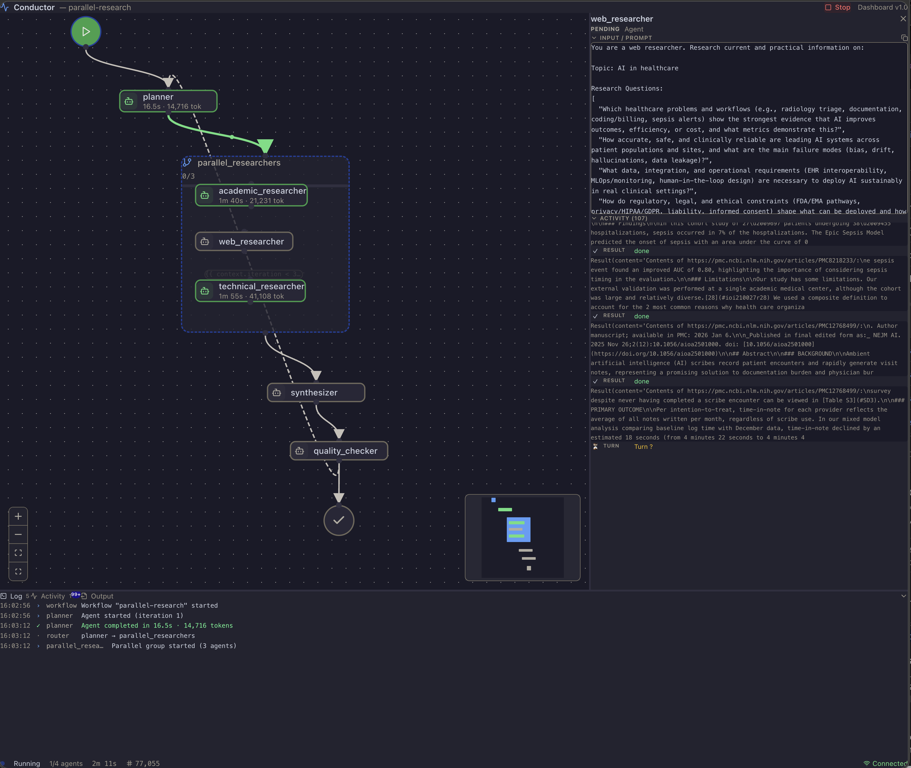

# Conductor

A CLI tool for defining and running multi-agent workflows with the GitHub Copilot SDK and Anthropic Claude.

[](https://github.com/microsoft/conductor/actions/workflows/ci.yml)
[](https://www.python.org/downloads/)

## Why Conductor?

Conductor makes multi-agent workflows — code review pipelines, research-then-synthesize flows, plan-then-implement loops — **repeatable, deterministic, and version-controlled**. You define your agents, their prompts, and the routing between them in a single YAML file:

- **Repeatable** — Same inputs follow the same path through the same agents.
- **Deterministic** — Routing uses Jinja2 templates and expression evaluation. First matching condition wins. No LLM in the orchestration loop, no tokens spent deciding what runs next.
- **Source-controlled** — Plain YAML files. Diff workflows in pull requests, version them with your code, run them the same way locally and in CI.

## Features

- **YAML-based workflows** - Define multi-agent workflows in readable YAML
- **Multiple providers** - GitHub Copilot, Anthropic Claude, Claude Agent SDK (experimental), or NousResearch Hermes (experimental) with seamless switching
- **Parallel execution** - Run agents concurrently (static groups or dynamic for-each)
- **Sub-workflow composition** - Reusable sub-workflows with templated `input_mapping`, usable inside `for_each` groups for dynamic fan-out
- **Script steps** - Run shell commands and route on exit code or parsed JSON stdout
- **Set steps** - Bind one or more Jinja2-evaluated values into the context (no LLM, no subprocess) for derived flags, computed defaults, and constants reused by many later prompts
- **Terminate steps** - Explicit terminal step with `status` (`success`/`failed`) and structured `reason` — distinguishable from the default `$end` path in CLI exit codes, dashboard state, and event logs
- **Dialog mode** - Agents can pause for multi-turn conversation when uncertain
- **Reasoning effort** - Unified `reasoning.effort` (low/medium/high/xhigh) per agent or workflow-wide, translated to each provider's native API
- **Workspace instructions** - Auto-discover and inject `AGENTS.md` / `CLAUDE.md` / `.github/copilot-instructions.md` into every agent's prompt
- **Conditional routing** - Route between agents based on output conditions
- **Human-in-the-loop** - Pause for human decisions with Markdown-rendered prompts and clickable file links
- **Safety limits** - Max iterations and timeout enforcement
- **[Web dashboard](#web-dashboard)** - Real-time workflow visualization with interactive DAG graph, breadcrumb navigation into sub-workflows, live streaming, and in-browser human gates
- **Validation** - Catches stale template references, missing inputs, and undeclared dependencies before runtime

## Installation

### Quick Install (Recommended)

**macOS / Linux:**
```bash
curl -sSfL https://aka.ms/conductor/install.sh | sh
```

**Windows (PowerShell):**
```powershell
irm https://aka.ms/conductor/install.ps1 | iex
```

The installer checks for [uv](https://docs.astral.sh/uv/) (installs it if missing), fetches the latest release with pinned dependencies, and verifies integrity via SHA-256 checksum.

### Updating

`conductor update` checks for a newer release and tells you the one-line command to upgrade. Upgrades happen via the install script — the same script you used to install — because in-process self-upgrade is unreliable on Windows (the running Python interpreter sits inside the venv that needs replacing).

```bash
conductor update
```

To upgrade, run the install script in a **new shell** (not from inside a running `conductor` process):

**macOS / Linux:**
```bash
curl -sSfL https://aka.ms/conductor/install.sh | sh
```

**Windows (PowerShell):**
```powershell
irm https://aka.ms/conductor/install.ps1 | iex
```

Or skip the copy-paste with `--apply`:

```bash
conductor update --apply
```

`--apply` launches the install script automatically — on Windows it opens in a new console window so you can watch progress; on macOS/Linux it replaces the current process. Either way, the running `conductor` exits before the installer touches the venv, so file locks release cleanly.

The install script handles file-lock safety (process detection, stale-file cleanup, and on Windows a rename-fallback when the venv directory can't be removed), retries with backoff, and verifies the installed version after install. If your shell ever gets into a bad state from a failed update, re-running the install script is always the right next step.

Conductor periodically checks GitHub for newer releases (cached for 24 hours under `~/.conductor/update-check.json`) and prints a one-line hint when one is available. To silence the hint permanently — for example when you manage upgrades through a package manager or company-mirrored install — set `CONDUCTOR_NO_UPDATE_CHECK=1` in your shell environment. The check is also skipped automatically for non-TTY invocations, `--silent` mode, the `update` subcommand, and `--help` / `--version`.

### Manual Install

```bash
# Install from GitHub
uv tool install git+https://github.com/microsoft/conductor.git

# Run the CLI
conductor run workflow.yaml

# Or run directly without installing
uvx --from git+https://github.com/microsoft/conductor.git conductor run workflow.yaml

# Install a specific branch, tag, or commit
uv tool install git+https://github.com/microsoft/conductor.git@branch-name
uv tool install git+https://github.com/microsoft/conductor.git@v1.0.0
uv tool install git+https://github.com/microsoft/conductor.git@abc1234
```

### Using pipx

```bash
pipx install git+https://github.com/microsoft/conductor.git
conductor run workflow.yaml

# Install a specific branch or tag
pipx install git+https://github.com/microsoft/conductor.git@branch-name
```

### Using pip

```bash
pip install git+https://github.com/microsoft/conductor.git
conductor run workflow.yaml

# Install a specific tag or commit
pip install git+https://github.com/microsoft/conductor.git@v1.0.0
```

### Use the Conductor skill in Claude Code or Copilot CLI

This repo doubles as a single-plugin marketplace that ships the `conductor`
skill from `plugins/conductor/skills/conductor/`. The skill teaches the
assistant the workflow YAML schema, CLI commands, and execution model.

**Claude Code:**

```text
/plugin marketplace add microsoft/conductor
/plugin install conductor@conductor
```

**GitHub Copilot CLI** (`gh skill` requires GitHub CLI 2.91+, public preview):

```bash
gh skill install microsoft/conductor conductor
```

The plugin ships only markdown — no executables, hooks, or MCP servers — so
trust verification is straightforward.

## Quick Start

### 1. Create a workflow file

```yaml
# my-workflow.yaml
workflow:
  name: simple-qa
  description: A simple question-answering workflow
  entry_point: answerer

agents:
  - name: answerer
    model: gpt-5.5
    prompt: |
      Answer the following question:
      {{ workflow.input.question }}
    output:
      answer:
        type: string
    routes:
      - to: $end

output:
  answer: "{{ answerer.output.answer }}"
```

### 2. Run the workflow

```bash
conductor run my-workflow.yaml --input question="What is Python?"
```

### 3. View the output

```json
{
  "answer": "Python is a high-level, interpreted programming language..."
}
```

## Web Dashboard

Conductor includes a built-in real-time web dashboard that lets you visualize and interact with your workflows as they run. Launch it with `--web`:

```bash
conductor run workflow.yaml --web --input question="What is Python?"
```



**Key features:**

- **Interactive DAG graph** — Zoomable, draggable workflow graph with animated edges showing execution flow and conditional routing
- **Live agent streaming** — Watch agent reasoning, tool calls, and outputs stream in real-time as each step executes
- **Three-pane layout** — Resizable panels for the graph, agent detail, and a tabbed output pane (Log, Activity, Output)
- **In-browser human gates** — Respond to human-in-the-loop decision points directly in the dashboard, no terminal needed
- **Per-node detail** — Click any node to see its prompt, metadata (model, tokens, cost), activity stream, and output
- **Background mode** — Run with `--web-bg` to start the dashboard in the background, print the URL, and exit. Use `conductor stop` to shut it down later.

```bash
# Run in background — prints dashboard URL and exits
conductor run workflow.yaml --web-bg --input topic="AI in healthcare"

# Stop a background workflow
conductor stop
```

## Providers

Conductor supports multiple AI providers. Choose based on your needs:

| Feature | Copilot | Claude | Claude Agent SDK | Hermes |
|---------|---------|--------|------------------|--------|
| **Tier** | Stable | Stable | Experimental | Experimental |
| **Pricing** | Subscription | Pay-per-token | Subscription | Pay-per-token (via hermes) |
| **Context Window** | Per-model | Per-model | Per-model | Per-model |
| **Tool Support (MCP)** | Yes | Planned | Yes (built-in) | No (hermes internal tools) |
| **Streaming** | Yes | Planned | Yes | No |
| **Best For** | Heavy usage, tools | Large context, pay-per-use | Full Claude Code toolset | Multi-provider model access |

### Using Copilot

```yaml
workflow:
  runtime:
    provider: copilot
    default_model: gpt-5.5
```

Copilot is the default provider — `runtime.provider` can be omitted entirely. Requires an active GitHub Copilot subscription and the GitHub CLI authenticated (`gh auth login`).

### Using Claude

```yaml
workflow:
  runtime:
    provider: claude
    default_model: claude-sonnet-5
```

Set your API key: `export ANTHROPIC_API_KEY=sk-ant-...`

### Using Claude Agent SDK (Experimental)

```yaml
workflow:
  runtime:
    provider: claude-agent-sdk
    default_model: claude-sonnet-5
```

Requires the `claude` CLI to be installed and authenticated. Install the SDK: `uv add 'claude-agent-sdk>=0.1.0'`

> **Note:** The `claude-agent-sdk` provider delegates tool and MCP management to the `claude` CLI; workflow-level tool/MCP config is **not** bridged into it. `runtime.mcp_servers` is rejected at the factory, and a workflow-level `tools:` block is rejected at `conductor validate` for any agent that omits `tools:` (it would otherwise inherit a list the CLI can't map). Omit `tools:` to grant the full `claude_code` preset, set an agent's `tools: []` to disable all tools, and configure MCP servers through your Claude Code settings instead.

### Using Hermes (Experimental)

```yaml
workflow:
  runtime:
    provider: hermes
    default_model: anthropic/claude-sonnet-5
```

Install the library: `pip install hermes-agent`

**See also:** [Claude Documentation](docs/providers/claude.md) | [Hermes Documentation](docs/providers/hermes.md) | [Provider Comparison](docs/providers/comparison.md) | [Migration Guide](docs/providers/migration.md)

### Using a Local / Custom LLM Endpoint (Ollama, vLLM, Azure OpenAI, ...)

`runtime.provider` also accepts a structured object that routes the
Copilot SDK at any OpenAI-compatible / Azure / Anthropic-shaped endpoint.
Useful for local inference (Ollama, vLLM, LM Studio) and managed
deployments (Azure OpenAI):

```yaml
workflow:
  runtime:
    provider:
      name: copilot
      type: openai                          # openai | azure | anthropic
      wire_api: completions                 # completions | responses
      base_url: http://localhost:11434/v1
      api_key: ${OPENAI_API_KEY:-ollama}
    default_model: llama3.1                 # match your endpoint's model name
```

The structured form is opt-in: a bare `provider: copilot` keeps the
default GitHub Copilot routing. See
[`examples/copilot-local-llm.yaml`](examples/copilot-local-llm.yaml) for
the full example (including an Azure OpenAI variant) and
[Configuration Guide → Custom Provider Routing](docs/configuration.md#custom-provider-routing-ollama--vllm--azure-openai)
for environment-variable fallbacks, security notes, and validator rules.

## CLI Reference

### `conductor run`

Execute a workflow from a YAML file.

```bash
conductor run <workflow.yaml> [OPTIONS]
```

| Option | Description |
|--------|-------------|
| `-i, --input NAME=VALUE` | Workflow input (repeatable) |
| `-m, --metadata KEY=VALUE` | Workflow metadata (repeatable; surfaced in `workflow_started`) |
| `--workspace-instructions` | Auto-discover `AGENTS.md` / `CLAUDE.md` / `.github/copilot-instructions.md` and prepend to every agent prompt |
| `--instructions PATH` | Explicit instructions file (repeatable) |
| `-p, --provider PROVIDER` | Override provider |
| `--dry-run` | Preview execution plan |
| `--skip-gates` | Auto-select at human gates |
| `--web` | Start real-time web dashboard |
| `--web-bg` | Run in background, print dashboard URL, exit |
| `--web-port PORT` | Port for web dashboard (0 = auto) |
| `-l, --log-file PATH` | Write logs to file |

Output verbosity is controlled by **root-level options**, which must appear
*before* the subcommand:

```bash
conductor --quiet run workflow.yaml    # -q: minimal output (agent lifecycle and routing only)
conductor --silent run workflow.yaml   # -s: no progress output (JSON result only)
```

### `conductor validate`

Validate a workflow file without executing.

```bash
conductor validate <workflow.yaml>
```

**Full CLI documentation:** [docs/cli-reference.md](docs/cli-reference.md)

## Cost Tracking

Conductor estimates per-agent and per-workflow costs from token usage and a
built-in pricing table (`src/conductor/engine/pricing.py`). When a model is
absent from the table, that agent's cost rolls up as `$0` rather than failing —
so for non-public, preview, or newly-released models you'll want to supply
pricing yourself.

Pricing resolves in this order, highest precedence first:

1. **Exact** match in workflow `runtime.cost.pricing`
2. **Exact** match in user `~/.conductor/pricing.yaml`
3. **Exact** match in built-in `DEFAULT_PRICING`
4. **Fuzzy** (versioned-suffix) match against built-in `DEFAULT_PRICING`

User and workflow overrides are exact-match only. List each concrete model
name you want to override; family-name entries do not auto-cover descendants.

### Per-workflow overrides

```yaml
workflow:
  cost:
    show_summary: true
    pricing:
      claude-opus-4.7-high:
        input_per_mtok: 15.00
        output_per_mtok: 75.00
        cache_read_per_mtok: 1.50
        cache_write_per_mtok: 18.75
```

### Machine-wide overrides

For pricing you want to apply to every workflow on a machine — typical for
preview models without published rates — drop a `~/.conductor/pricing.yaml`:

```yaml
pricing:
  claude-opus-4.7-high:
    input_per_mtok: 15.00
    output_per_mtok: 75.00
  gpt-5.4:
    input_per_mtok: 2.00
    output_per_mtok: 8.00
```

* Missing file is silently OK.
* Malformed file is a hard error with a pointer to the path; bypass a broken
  file by pointing `CONDUCTOR_PRICING_FILE` at a path that doesn't exist.
* Workflow entries always win for the same model name.
* Override entries are exact-match only — list each concrete model name
  (e.g. `claude-opus-4-20250514`, not just `claude-opus-4`).

Run `conductor pricing path` to print the resolved file location.

## Workflow Registries

Conductor supports named workflow registries — GitHub repos or local directories
containing shared workflows. Configure a registry once, then run workflows by
short name.

### Quick start

```bash
# Add a registry
conductor registry add official myorg/conductor-workflows --default

# List available workflows
conductor registry list official

# Run a workflow from the registry
conductor run qa-bot                       # latest from default registry
conductor run 'qa-bot@official#v1.2.3'     # specific tag (quote the #)
conductor run 'qa-bot@official#main'       # branch HEAD (re-resolved on fetch)
```

See [docs/design/registry.md](docs/design/registry.md) for the full design.

## Examples

See the [`examples/`](./examples/) directory for complete workflows:

| Example | Description |
|---------|-------------|
| [simple-qa.yaml](./examples/simple-qa.yaml) | Basic single-agent Q&A |
| [for-each-simple.yaml](./examples/for-each-simple.yaml) | Dynamic parallel processing |
| [parallel-research.yaml](./examples/parallel-research.yaml) | Static parallel execution |
| [design-review.yaml](./examples/design-review.yaml) | Human gate with loop pattern |
| [script-step.yaml](./examples/script-step.yaml) | Script step with exit_code routing |
| [set-step.yaml](./examples/set-step.yaml) | Set step deriving named values + boolean-routed branching |
| [wait-step.yaml](./examples/wait-step.yaml) | Wait step + script for a polling loop-back pattern |
| [wait-smoke.yaml](./examples/wait-smoke.yaml) | Minimal wait-only smoke test (no provider required) |
| [terminate.yaml](./examples/terminate.yaml) | Explicit `type: terminate` with success and failure paths |

**More examples and running instructions:** [examples/README.md](./examples/README.md)

## Documentation

| Document | Description |
|----------|-------------|
| [Workflow Syntax](./docs/workflow-syntax.md) | Complete YAML schema reference |
| [CLI Reference](./docs/cli-reference.md) | Full command-line documentation |
| [Parallel Execution](./docs/parallel-execution.md) | Static parallel groups |
| [Dynamic Parallel](./docs/dynamic-parallel.md) | For-each groups and array processing |
| [Claude Provider](./docs/providers/claude.md) | Claude setup and configuration |
| [Hermes Provider](./docs/providers/hermes.md) | Hermes setup and configuration |
| [Provider Comparison](./docs/providers/comparison.md) | Copilot vs Claude vs Hermes decision guide |

## Development

### Prerequisites

- Python 3.12+
- [uv](https://github.com/astral-sh/uv) for dependency management

### Setup

```bash
git clone https://github.com/microsoft/conductor.git
cd conductor
make dev
```

### Windows

On Windows, use `uv` directly instead of `make`:

```powershell
uv sync --all-extras    # instead of make dev
uv run pytest tests/    # instead of make test
uv run ruff check .     # instead of make lint
uv run ruff format .    # instead of make format
```

**Copilot CLI path:** Windows `subprocess` cannot resolve `.bat`/`.ps1` wrappers by name alone. If you see `[WinError 2] The system cannot find the file specified` when running workflows, set the full path to the Copilot CLI:

```powershell
# Find your copilot CLI
Get-Command copilot* | Format-Table Name, Source

# Set the path (use the .cmd variant from npm)
$env:COPILOT_CLI_PATH = "C:\Users\<you>\AppData\Roaming\npm\copilot.cmd"
```

### Common Commands

```bash
make test             # Run tests
make test-cov         # Run tests with coverage
make lint             # Check linting
make format           # Auto-fix and format code
make typecheck        # Type check
make check            # Run all checks (lint + typecheck)
make validate-examples  # Validate all example workflows
```

### Code Style

- [Ruff](https://github.com/astral-sh/ruff) for linting and formatting
- [ty](https://github.com/astral-sh/ty) for type checking
- Google-style docstrings

## Contributing

This project welcomes contributions and suggestions.  Most contributions require you to agree to a
Contributor License Agreement (CLA) declaring that you have the right to, and actually do, grant us
the rights to use your contribution. For details, visit [Contributor License Agreements](https://cla.opensource.microsoft.com).

When you submit a pull request, a CLA bot will automatically determine whether you need to provide
a CLA and decorate the PR appropriately (e.g., status check, comment). Simply follow the instructions
provided by the bot. You will only need to do this once across all repos using our CLA.

This project has adopted the [Microsoft Open Source Code of Conduct](https://opensource.microsoft.com/codeofconduct/).
For more information see the [Code of Conduct FAQ](https://opensource.microsoft.com/codeofconduct/faq/) or
contact [opencode@microsoft.com](mailto:opencode@microsoft.com) with any additional questions or comments.

To submit a pull request, follow these steps:

1. Fork the repository
2. Create a feature branch (`git checkout -b feature/amazing-feature`)
3. Make your changes
4. Run tests and checks (`make test && make check`)
5. Commit your changes (`git commit -m 'Add amazing feature'`)
6. Push to the branch (`git push origin feature/amazing-feature`)
7. Open a Pull Request

## Trademarks

This project may contain trademarks or logos for projects, products, or services. Authorized use of Microsoft
trademarks or logos is subject to and must follow
[Microsoft's Trademark & Brand Guidelines](https://www.microsoft.com/legal/intellectualproperty/trademarks/usage/general).
Use of Microsoft trademarks or logos in modified versions of this project must not cause confusion or imply Microsoft sponsorship.
Any use of third-party trademarks or logos are subject to those third-party's policies.


## License

MIT License - see [LICENSE](./LICENSE) for details.
